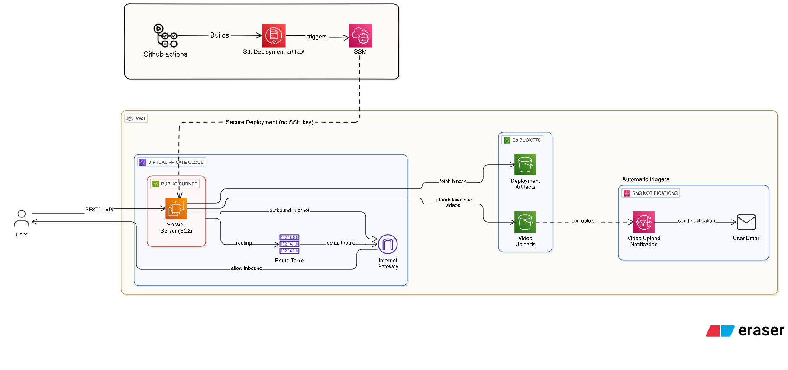

# Video Upload Service

A secure, scalable video upload service built with Go and deployed on AWS infrastructure. Users can upload MP4 videos through a REST API, with automatic storage in S3 and email notifications upon completion.

## Architecture Overview



The system demonstrates production-ready patterns including Infrastructure as Code, CI/CD automation, event-driven architecture, and security-first deployment practices.

## Features

- **RESTful API** for video file uploads
- **File Validation** - Only MP4 files up to 100MB accepted
- **AWS S3 Storage** with UUID-based file naming
- **Automatic Notifications** via S3 → SNS integration
- **Secure Deployment** using AWS Systems Manager (no SSH keys)
- **Infrastructure as Code** managed with Terraform
- **CI/CD Pipeline** with GitHub Actions

## Tech Stack

- **Backend**: Go with Chi router
- **Infrastructure**: AWS (EC2, S3, SNS, VPC, IAM, SSM)
- **IaC**: Terraform
- **CI/CD**: GitHub Actions
- **Deployment**: AWS Systems Manager

## API Endpoints

### Upload Video
```http
POST /upload
Content-Type: multipart/form-data
```

**Parameters:**
- `video` (file): MP4 video file (max 100MB)

**Response:**
```json
{
  "video_id": "23c5e135-0721-4fdf-b165-05db0140eb92",
  "original_filename": "video1.mp4",
  "file_size": 17119326,
  "status": "uploaded",
  "upload_time": "2025-08-31T20:07:53Z"
}
```

### Health Check
```http
GET /health
```

**Response:**
```json
{
  "status": "healthy",
  "timestamp": "2025-08-31T20:07:53Z"
}
```

## Quick Start

### Prerequisites
- AWS Account with appropriate permissions
- Terraform installed
- Go 1.23+ installed
- GitHub account for CI/CD

### Local Development

1. **Clone the repository**
```bash
git clone https://github.com/yourusername/aws-video-streaming-platform
cd aws-video-streaming-platform
```

2. **Set up environment variables**
```bash
cp .env.example .env
# Edit .env with your AWS resource names
```

3. **Install dependencies**
```bash
go mod tidy
```

4. **Run the server**
```bash
go run main.go
```

5. **Test the API**
```bash
curl -X POST -F "video=@test.mp4" http://localhost:3000/upload
```

### Production Deployment

1. **Deploy infrastructure**
```bash
cd terraform
terraform init
terraform plan
terraform apply
```

2. **Configure GitHub Secrets**
- `AWS_ACCESS_KEY_ID`
- `AWS_SECRET_ACCESS_KEY`

3. **Configure GitHub Variables**
- `UPLOAD_BUCKET_NAME`
- `SNS_TOPIC_ARN`
- `DEPLOYMENT_BUCKET_NAME`

4. **Push code to trigger deployment**
```bash
git push origin main
```

## Environment Variables

| Variable | Description | Example |
|----------|-------------|---------|
| `UPLOAD_BUCKET_NAME` | S3 bucket for video storage | `video-upload-abc123` |
| `SNS_TOPIC_ARN` | SNS topic for notifications | `arn:aws:sns:us-east-1:123:topic` |
| `PORT` | Server port | `3000` |

## AWS Resources Created

- **VPC** with public subnet and internet gateway
- **EC2 instance** (t2.micro) with IAM role
- **S3 buckets** for video storage and deployment artifacts
- **SNS topic** with email subscription for notifications
- **IAM roles** with least-privilege permissions
- **Security groups** with restricted access

## Security Features

- **No SSH Keys**: Deployment uses AWS Systems Manager
- **IAM Roles**: EC2 uses role-based authentication
- **Least Privilege**: Minimal required permissions only
- **Environment Variables**: No hardcoded credentials
- **Input Validation**: File type and size restrictions

## Scalability Considerations

The current architecture supports moderate traffic loads. For production scale:

- **Auto Scaling Groups** for horizontal scaling
- **Application Load Balancer** for traffic distribution
- **SQS queues** for asynchronous processing
- **CloudFront CDN** for global content delivery
- **RDS/DynamoDB** for persistent metadata storage

## Troubleshooting

### Common Issues

**Server crashes after upload:**
- Check environment variables are set correctly
- Verify SNS topic ARN is valid

**SSM deployment fails:**
- Ensure EC2 has `AmazonSSMManagedInstanceCore` policy
- Check SSM agent is running on EC2

**File upload fails:**
- Verify file is MP4 format and under 100MB
- Check S3 bucket permissions

### Logs
```bash
# Check application logs on EC2
cat /home/ec2-user/app.log

# Check SSM command status
aws ssm list-command-invocations --command-id <command-id>
```

## Contributing

1. Fork the repository
2. Create a feature branch
3. Make changes and add tests
4. Submit a pull request

## License

MIT License - see [LICENSE](LICENSE) file for details.

## Contact

- **Author**: Neel Barvaliya
- **Email**: neilpwith123@gmail.com
- **GitHub**: [@NeilNeel](https://github.com/NeilNeel)

---

**Note**: This project is designed for learning purposes and demonstrates AWS cloud architecture patterns. For production use, additional security hardening and monitoring should be implemented.